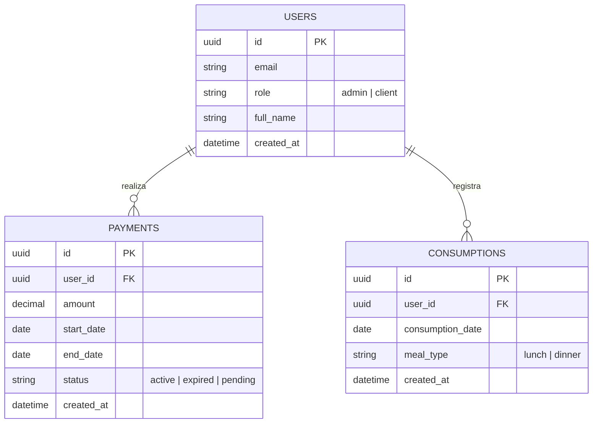
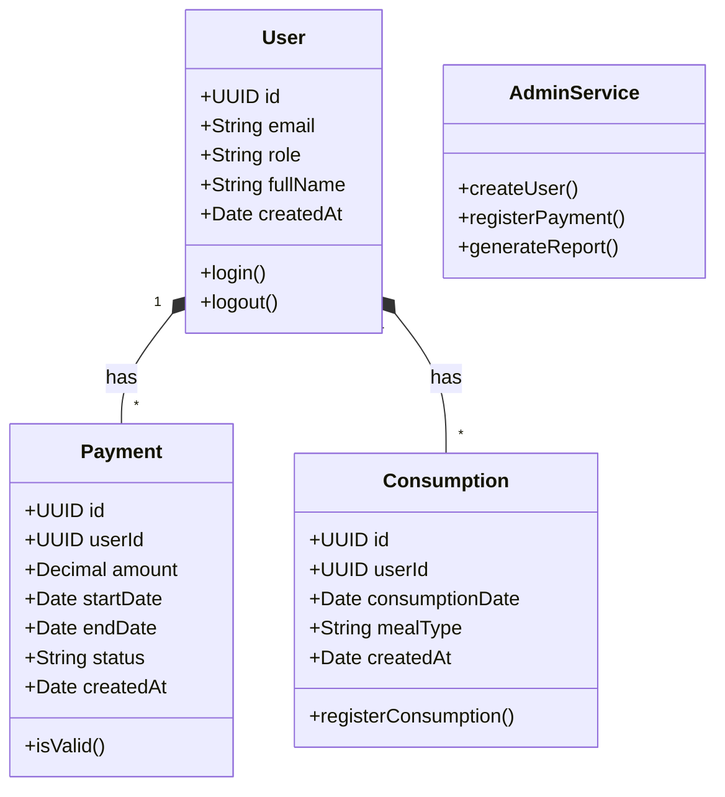

# Implementación del Backend para "Plataforma Digital Para El Manejo de Mensualidades Gastronómicas"

De acuerdo al documento `proyectoRestaurante.pdf`, el proyecto requiere el desarrollo de un prototipo bajo una arquitectura cliente-servidor usando **Angular** (frontend) y **Supabase** (Backend-as-a-Service, PostgreSQL) para la persistencia de datos y autenticación.

## User Review Required

> [!IMPORTANT]
> **Creación del proyecto en Supabase:** Al ser Supabase un servicio en la nube, es necesario crear un proyecto en su plataforma (https://supabase.com/). ¿Ya tienes un proyecto de Supabase creado o quieres que definamos el esquema SQL aquí para que tú lo ejecutes en tu instancia de Supabase?

> [!WARNING]
> La integración con Angular requerirá instalar la librería oficial `@supabase/supabase-js`. 

## Open Questions

- ¿Deseas que los diagramas UML (Casos de Uso, Entidad-Relación y Clases) los coloque en un documento PDF/Imagen aparte, o es suficiente con tenerlos generados en código (Mermaid) dentro de esta documentación para que los puedas exportar?
- Para la autenticación, ¿se usarán correos institucionales o cualquier tipo de correo para los estudiantes y administradores?

## Modelos y Diagramas

A continuación se presentan los modelos solicitados basados en los requerimientos del proyecto.

### Diagrama de Casos de Uso

```mermaid
usecaseDiagram
    actor Cliente
    actor Administrador
    
    Cliente --> (Iniciar Sesión)
    Cliente --> (Registrar Consumo Diario)
    Cliente --> (Ver Estado de Mensualidad)
    
    Administrador --> (Iniciar Sesión)
    Administrador --> (Gestionar Usuarios)
    Administrador --> (Registrar/Validar Pagos)
    Administrador --> (Generar Reportes)
    Administrador --> (Monitorear Consumos)
```

### Diagrama Entidad-Relación (ERD)



### Diagrama de Clases



## Proposed Changes

### Database (Supabase / PostgreSQL)

Se propondrá un script SQL para ejecutar en Supabase que creará las tablas, habilitará *Row Level Security (RLS)* y definirá las políticas de seguridad (para que los clientes solo vean sus propios datos y los administradores vean todo).

#### [NEW] `supabase/schema.sql`
Script SQL con la definición de:
- Tabla `users` (extiende la tabla de autenticación de Supabase).
- Tabla `payments` (mensualidades).
- Tabla `consumptions` (consumos diarios).
- Políticas de seguridad (RLS).

### Frontend (Angular)

Se integrará Supabase al proyecto existente de Angular.

#### [MODIFY] `package.json`
Se instalará `@supabase/supabase-js`.

#### [NEW] `src/environments/environment.ts`
Se agregarán las variables de entorno para Supabase (`SUPABASE_URL` y `SUPABASE_KEY`).

#### [NEW] `src/app/services/supabase.service.ts`
Servicio centralizado en Angular para manejar la inicialización del cliente de Supabase, la autenticación y las consultas a la base de datos (pagos y consumos).

#### [MODIFY] Componentes Existentes (`inicio`, `login`)
Se conectarán estos componentes al `supabase.service.ts` para que el inicio de sesión y la vista de inicio utilicen datos reales desde el backend.

## Verification Plan

### Automated Tests
- Verificación de tipos en TypeScript durante la compilación (`ng build`).
- Linting del código Angular.

### Manual Verification
1. Ingresar a la aplicación y realizar un flujo de Login usando Supabase Auth.
2. Como administrador: Registrar un pago para un cliente y verificar que se refleje en la base de datos.
3. Como cliente: Registrar un consumo y verificar que el sistema valide que tiene una mensualidad activa.
4. Validar que la información se guarda y consulta correctamente desde Supabase.
